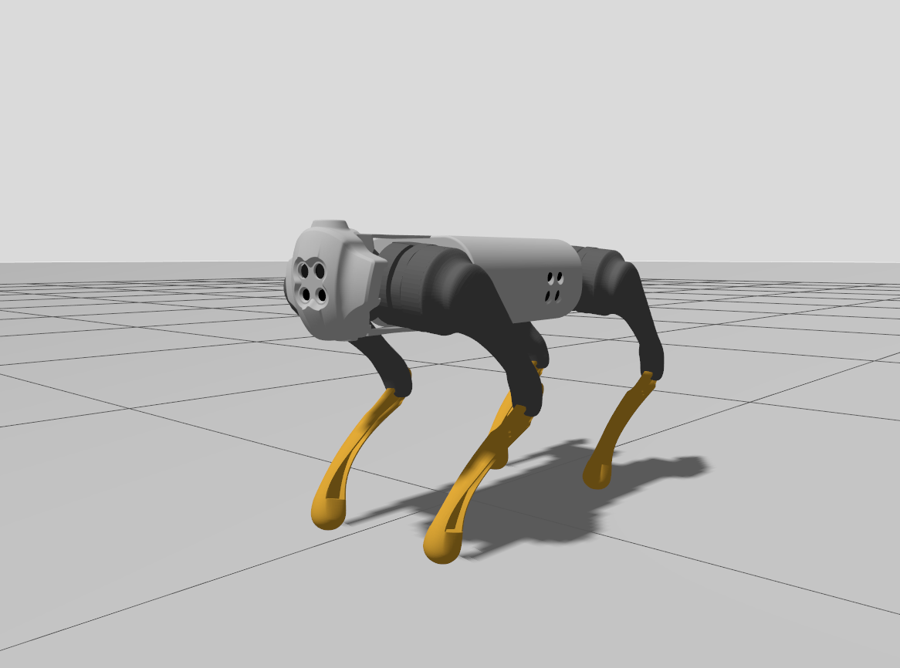
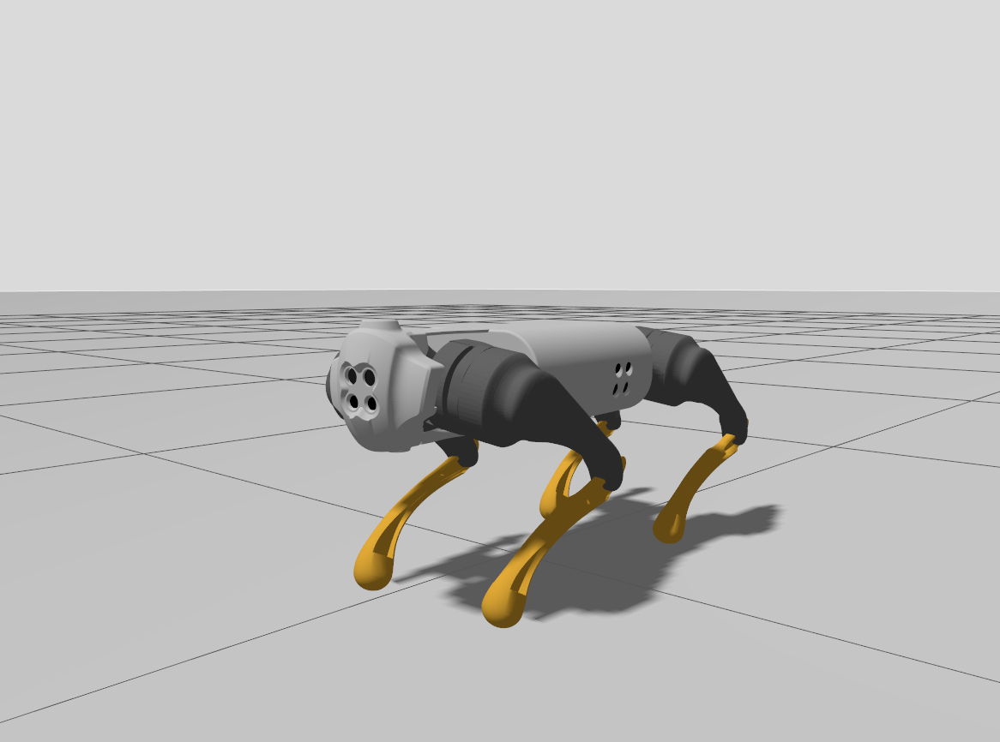

# ROS 2 Quadruped Locomotion Simulation

This repository contains a ROS 2 (Jazzy) workspace for simulating and controlling a quadruped robot. The project bridges the gap between mechanical kinematics and modern robotics software architecture, utilizing a fully containerized development environment for strict reproducibility.

## System Architecture
* **Framework:** ROS 2 Jazzy Jalisco
* **Environment:** Docker / VS Code DevContainers (Ubuntu base)
* **Physics Engine:** Gazebo / Isaac Sim (TBD)
* **Hardware Acceleration:** NVIDIA GPU Passthrough & X11 Display Forwarding

## Current Progress



## Prerequisites
To run this project exactly as intended without managing local dependencies, ensure you have the following installed on your host machine:
1. [Docker](https://docs.docker.com/get-docker/)
2. [Visual Studio Code](https://code.visualstudio.com/)
3. The [Dev Containers](https://marketplace.visualstudio.com/items?itemName=ms-vscode-remote.remote-containers) extension for VS Code
4. NVIDIA Container Toolkit (for GPU passthrough)

## Getting Started

### 1. Clone the Repository
```bash
git clone [https://github.com/joshkwka/ros2-quadruped-locomotion.git](https://github.com/joshkwka/ros2-quadruped-locomotion.git)
cd ros2-quadruped-locomotion
```

### 2. Open in VS Code
Open the cloned directory in Visual Studio Code:
```
code .
```
### 3. Launch the DevContainer
This project uses a `.devcontainer` to automatically install ROS 2, configure dependencies, and handle X11/GPU forwarding.
1. In VS Code, open the Command Palette (Ctrl+Shift+P on Windows/Linux, Cmd+Shift+P on Mac).
2. Type and select: `Dev Containers: Reopen in Container`.
3. Wait a few moments for the Docker image to build and attach. Once connected, open a new terminal in VS Code. You will now be operating as `root` inside the container with ROS 2 automatically sourced.

### 4. Build the Workspace
Navigate to the root of the workspace inside the container and compile the packages:
```
colcon build
source install/setup.bash
```

### 5a. Launch the Visualization
To view the robot model in RViz and interact with the joint states:
```
ros2 launch quadruped_description display.launch.py
```

### 5b. Launch the Gazebo Simulation 
Launch the robot model in a Gazebo physics simulation:
```
ros2 launch quadruped_control sim_launch.py
```

### 6. Run the "Push-Up" Script
To test the inverse kinematics, run the ik_node executable to see the robot push up and squat down in a loop:
```
ros2 run quadruped_locomotion ik_node
```

## Current Packages
- `quadruped_description`: Contains the URDF, 3D meshes, and physical parameters of the robot. Utilizes the open-source Go1 model provided by [Unitree Robotics](https://github.com/unitreerobotics/unitree_ros). (Completed)
- `quadruped_locomotion`: The high-level "Brain" of the robot. This C++ package utilizes the **Eigen** library for high-performance linear algebra, handling gait scheduling, trajectory planning, and Inverse Kinematics (IK). It translates velocity commands into synchronized joint-space trajectories for all 12 degrees of freedom. (Completed)
- `quadruped_control`: The low-level "Spine" of the robot. This C++ based package interfaces with `ros2_control` to manage PID loops and hardware abstraction. It takes the target joint angles generated by the locomotion node and converts them into physical motor torques in the simulation. (Completed)

## Learnings & Technical Takeaways
- **Bridging Analytical Math and Physical URDFs:** Standard C++ math libraries evaluate angles based on standard Cartesian quadrants (e.g., std::atan2 treating the positive axis as 0°). However, physical robot URDFs often define 0° as the joint pointing straight down toward gravity. I learned to successfully map textbook trigonometric equations (like the Law of Cosines) to actual motor deflection angles by applying geometric transformations and axis-sign flips to synchronize the software's coordinate frame with the hardware's zero-state.
- **Coordinate Frame Decoupling:** To make the Inverse Kinematics (IK) modular and agnostic to the robot's body width, I separated the kinematics math into two distinct steps: generating high-level targets in the global "Trunk Frame" (center of mass), and translating those into a "Local Hip Frame" before executing the IK solver.
- **Containerized Hardware Acceleration:** Configuring a reproducible DevContainer for robotics requires more than just installing dependencies. I learned how to successfully forward X11 display sockets (/tmp/.X11-unix) and configure NVIDIA GPU passthrough into a Docker container to enable real-time, hardware-accelerated GUI applications like RViz without polluting the host machine.
